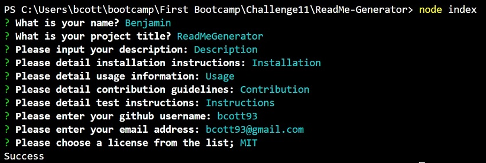

# ReadMeGenerator

In this Challenge, I was tasked with building a command-line application that dynamically generates a professional README.md file from a user's input.

## The Goal

There were a number of objectives for this task, they were:

- Create a command-line application that accepts the following user input;

    - The title of the project
    - Sections entitled:
        - Description
        - Table of Contents
        - Installation
        - Usage
        - License
        - Contributing
        - Tests
        - Questions

- When a user enters the project title, it's displayed as the title of the README.
- When a user enters a description, installation instructions, usage information, contribution guidelines, and test instructions, this information is added to the sections of the README entitled Description, Installation, Usage, Contributing, and Tests.
- When a user chooses a license for their application from a list of options, a badge for that license is added near the top of the   README and a notice is added to the section of the README entitled License that explains which license the application is covered under.
- When a user enters their GitHub username, it's added to the section of the README entitled Questions, with a link to their GitHub profile.
- When a user enters their email address, it's added to the section of the README entitled Questions, with instructions on how to reach them with additional questions.
- When a user clicks on the links in the Table of Contents, they are taken to the corresponding section of the README.

### Usage

To view the project, please follow the links below

https://bcott93.github.io/Readme-Generator

A link to the video for your reference, with an embedded copy below:
https://drive.google.com/file/d/1fV58Na5TIHacGy2eEGOzZAuvjvSfsi5-/view

[Walkthrough Video](assets/ReadMeGenerator%20-%20Video%20Walkthrough.webm)

### Credits:

* [Node.js FileSystem](https://nodejs.org/api/fs.html)
* [NPM Inquirer](https://www.npmjs.com/package/inquirer)

### License

Please see the License in the Repo. 

